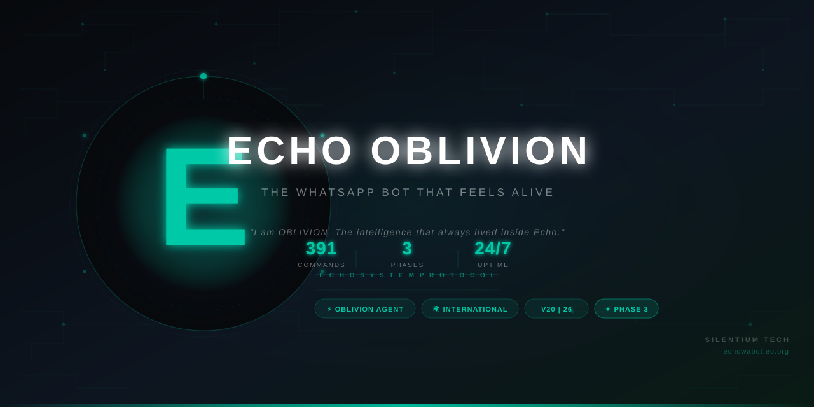

<p align="center">
  
</p>

<p align="center">
  <a href="https://github.com/SILENTIUM-TECH/echobot/releases"></a>
  <a href="https://echowabot.eu.org"></a>
  <a href="docs/OBLIVION.md"></a>
  <a href="LICENSE"></a>
  <a href="https://github.com/SILENTIUM-TECH/echobot/stargazers"></a>
</p>

<h3 align="center">The WhatsApp bot that feels alive.</h3>
<p align="center">
AI that talks back. Media that just downloads. Groups that protect themselves.<br>
<strong>OBLIVION</strong> — the intelligence that was always inside Echo — backed by a full intelligence, cryptography, and AI-analysis layer.
</p>

<p align="center">
  <a href="https://echowabot.eu.org"><b>🌐 Dashboard</b></a> ·
  <a href="https://t.me/devaura_echobot"><b>🤖 Telegram Bot</b></a> ·
  <a href="https://t.me/silentium_01"><b>📢 Channel</b></a> ·
  <a href="https://vt.tiktok.com/ZSXJwrPLV/"><b>🎵 Pairing Walkthrough</b></a> ·
  <a href="docs/COMMANDS.md"><b>📋 Commands</b></a> ·
  <a href="docs/FEATURES.md"><b>🧬 Feature Deep-Dive</b></a>
</p>

---

## ⚡ What's New in V20|26

> The most stable and capable build of Echo Oblivion to date.

| Area | Update |
|---|---|
| 🧠 **OBLIVION Core** | `reply_after` confirmation messages now always deliver — both the AI reply and the follow-up send correctly every time |
| 🛡️ **Permission Engine** | Owner, Sudo, and PrimeLord flags fully resolved in all `.oblivion` sub-commands — owners can now access `.oblivion logs`, `.oblivion broadcast`, and all restricted agent operations |
| 🔗 **Pairing Flow** | Session grace window now set before the connection delay — no more accidental session wipes during the pairing handshake. Reconnect-on-early-disconnect is reliable |
| 🔌 **Native Bridge** | Noise protocol handshake hardened — connection is stable across Node versions and platforms |
| 🗺️ **Command Routing** | Natural-language → command dispatch tightened. Ambiguous patterns removed so free-text chat never accidentally triggers unrelated commands |
| 🎮 **Command Registry** | Duplicate registry entries resolved — group admin commands now route correctly at the right permission level |
| 📡 **Telegram Integration** | 409 Conflict polling errors silenced — single log line every 5 minutes instead of per-second spam |

See [CHANGELOG.md](CHANGELOG.md) for the complete version history.

---

## ✦ What is Echo Oblivion?

Echo Oblivion is not a typical WhatsApp bot.

It is a full autonomous AI agent system — built on the Baileys multi-device framework — that runs 24/7 on dedicated infrastructure. Your phone never needs to be on. Your data is never consumed. You link your number once, and Echo handles the rest.

Inside Echo lives **OBLIVION** — an AI agent that thinks, remembers, executes commands, manages your groups, speaks any language, and adapts its entire personality to each user. It was always there. Now it has a name.

**Phase 2** added 27 capabilities across four new layers: passive intelligence (status tracking, group culture profiling, trend detection), cryptography (steganography, split-key encrypted tunnels, time-delayed messages), AI analysis (vision, document intelligence, voice emotion, personality profiling, debate judging), and OSINT (phone/username lookups, brand intelligence, reverse image search).

**Phase 3** built on that with 25 more: anti-view-once interception, time machine summaries, encrypted memo storage, impersonation simulation, autonomous group autopilot, AI fact-checking, reputation scoring, breach detection, language coaching, invisible status broadcasting, and more.

That is **391 live commands** across three phases, all accessible from a single paired WhatsApp number.

---

## ⚡ OBLIVION Agent

> *"I am OBLIVION. The intelligence that has always lived inside Echo.*
> *You were using me before you even knew my name."*

OBLIVION is the AI core of Echo Oblivion. It is not a chatbot.

| Capability | Description |
|---|---|
| 🧠 **Autonomous Execution** | Speak naturally — OBLIVION executes the right command without you knowing its name |
| 🌍 **Multi-Language** | Detects and responds in your language automatically, every message |
| 💾 **Per-User Memory** | Remembers your preferences, conversation history, and personality across sessions |
| 🗣️ **Voice Notes** | Can speak back in your language as a WhatsApp voice note |
| ⏰ **Scheduled Actions** | "Close the group at midnight" — it will, exactly when you said |
| 🎭 **Custom Persona** | Give it custom instructions that stick forever until you change them |
| 🛡️ **Permission-Aware** | Never executes admin commands for non-admins — rank-gated throughout |
| 🔇 **Group Smart Silence** | Active but not noisy — it speaks when it matters, stays quiet otherwise |
| 🌐 **Live Context** | Pulls in real-time weather, news, prices, and date info when relevant |
| 🔁 **Multi-Provider AI** | Pollinations.ai primary → Groq (Llama 3.3 70B) → Gemini 2.5 Flash → OpenRouter fallback chain |

Full OBLIVION documentation: **[docs/OBLIVION.md](docs/OBLIVION.md)**

---

## 🗺️ System Architecture

```
┌─────────────────────────────────────────────────────────────┐
│                    ECHO OBLIVION SYSTEM                     │
├──────────────┬──────────────────────────┬───────────────────┤
│  WhatsApp    │      OBLIVION Agent      │   Web Dashboard   │
│  (Baileys)   │   ┌──────────────────┐  │   (echowabot.eu)  │
│              │   │  Memory Layer    │  │                   │
│  Multi-device│   │  Context Builder │  │  Pair · Manage   │
│  session via │   │  AI Router       │  │  Sessions · Stats │
│  Noise proto │   │  Intent Engine   │  │                   │
│              │   └──────────────────┘  │                   │
├──────────────┼──────────────────────────┼───────────────────┤
│        391 Commands · 3 Phases          │  Telegram Panel   │
│   Download · AI · Moderation · OSINT    │  /pair · /status  │
│   Crypto · Intelligence · Analysis      │  /broadcast       │
├─────────────────────────────────────────┴───────────────────┤
│                        Data Layer                           │
│   MongoDB (sessions · memory · groups) · File cache         │
├─────────────────────────────────────────────────────────────┤
│                       AI Providers                          │
│  Pollinations.ai → Groq Llama-3.3-70B → Gemini → OpenRouter│
└─────────────────────────────────────────────────────────────┘
```

Full architecture breakdown: **[docs/ARCHITECTURE.md](docs/ARCHITECTURE.md)**

---

## 🎯 Quick Start

Three ways to get Echo running:

### Option 1 — Hosted (Fastest, zero setup)
1. Open **[t.me/devaura_echobot](https://t.me/devaura_echobot)** on Telegram
2. Send `/pair +[your number]`
3. Enter the code in WhatsApp → Settings → Linked Devices → Link a Device → Link with phone number instead
4. Send `.menu` in any WhatsApp chat to confirm it's live

### Option 2 — Web Dashboard
1. Go to **[echowabot.eu.org](https://echowabot.eu.org)** → create a free account
2. Navigate to WhatsApp Sessions → Add Session
3. Enter your number → click **Get Pairing Code**
4. Enter code in WhatsApp → done

### Option 3 — Self-Host
Run on your own server. Full guide: **[docs/DEPLOYMENT.md](docs/DEPLOYMENT.md)**

> 📺 **Video walkthrough:** [TikTok pairing tutorial](https://vt.tiktok.com/ZSXJwrPLV/)

---

## 📊 Feature Overview

<details>
<summary><b>📥 Downloads & Media (40+ commands)</b></summary>

TikTok, Instagram, Facebook, Twitter/X, YouTube, Spotify, SoundCloud, Pinterest, Google Drive, Mediafire, APK downloads — all without watermarks. AI sticker creation, video-to-sticker conversion, HD upscaling, background removal, face swap, and photo reconstruction.

</details>

<details>
<summary><b>🤖 AI & OBLIVION (60+ commands)</b></summary>

Natural conversation with per-user memory. AI image generation (Flux, Sora, Nano, MagicStudio). AI video generation (Luma, GenVid). Song writing, dream analysis, debate judging, group horoscopes, fact-checking, and more. OBLIVION autonomous execution means you never need to know a command's name.

</details>

<details>
<summary><b>🛡️ Group Management (50+ commands)</b></summary>

Anti-link, anti-bot, anti-badword, anti-impersonation. Warning system with auto-kick thresholds. Bulk add/kick/promote. Poll system, welcome/goodbye messages, group lock, and admin tools. `.constitution` auto-generates group rules with AI. `.negotiate` mediates disputes with a structured AI verdict.

</details>

<details>
<summary><b>🧬 Intelligence & OSINT (Phase 2, 27 features)</b></summary>

Status spy, ghost-read estimator, reverse image search, OSINT phone/username scanner. Group culture DNA analysis, sentiment tracking, trend detection. Personality profiling, voice emotion analysis, document intelligence. Full breakdown: [docs/FEATURES.md](docs/FEATURES.md).

</details>

<details>
<summary><b>🔐 Cryptography (Phase 2)</b></summary>

Steganography (hide messages inside images), split-key encrypted tunnels between two users, time-delayed and trigger-based message delivery, and self-destructing notes.

</details>

<details>
<summary><b>⚙️ Phase 3 (25 features)</b></summary>

Anti-view-once interception, AI time machine summaries, encrypted memo storage, autopilot group management, reputation scoring, breach detection, language coaching, AI group constitutions, silent group monitoring, AI dispute mediation, invisible status posting, and more. Full breakdown: [docs/PHASE3.md](docs/PHASE3.md).

</details>

---

## 💎 Premium Access

| Feature | Free | Premium |
|---|---|---|
| Core downloads (TikTok, IG, YouTube, etc.) | ✅ | ✅ |
| Basic AI chat (OBLIVION) | ✅ | ✅ |
| Group moderation tools | ✅ | ✅ |
| View-once recovery | ✅ | ✅ |
| OSINT & intelligence features | ✅ | ✅ |
| Phase 3 features | ✅ | ✅ |
| **AI image generation** (Flux, Sora, Nano) | ❌ | ✅ |
| **AI video generation** (Luma, GenVid) | ❌ | ✅ |
| **OBLIVION voice note replies** | ❌ | ✅ |
| **Custom AI persona (permanent)** | ❌ | ✅ |
| **Unlimited AI requests** (no cooldown) | ❌ | ✅ |
| **Multi-number pairing** | ❌ | ✅ |
| **AI document & voice analysis** | ❌ | ✅ |
| **Time Machine** (AI chat summaries) | ❌ | ✅ |
| **Priority infrastructure** | ❌ | ✅ |

To upgrade: **[t.me/devaura_echobot](https://t.me/devaura_echobot)** → send `/premium`

---

## 🔐 Permission Levels

Echo uses a six-tier rank system. Every command declares exactly which rank can use it — OBLIVION enforces this autonomously.

| Rank | Who | Commands |
|---|---|---|
| 🔴 Creator | Benjamin (Dev Aura) | All commands + system-level operations |
| 🟠 PrimeLord | Appointed system-level admins | Near-total access |
| 🟡 Sudo | Trusted cross-group moderators | Most admin functions |
| 🟢 Owner | Bot owners (people who paired a number) | Session + group control |
| 🔵 Admin | WhatsApp group admins | Group moderation |
| ⚪ Member | Everyone else | Downloads, AI, personal tools |

---

## 📚 Documentation

| Document | Description |
|---|---|
| [📖 About](docs/ABOUT.md) | The story behind Echo Oblivion, architecture, and Silentium Techies |
| [📋 Commands](docs/COMMANDS.md) | Complete command reference — 391 commands across 3 phases |
| [🧬 Features](docs/FEATURES.md) | Usage + technical deep-dive on every Phase 2 capability |
| [⚙️ Phase 3](docs/PHASE3.md) | All 25 Phase 3 features documented |
| [🧠 OBLIVION](docs/OBLIVION.md) | Full OBLIVION agent documentation |
| [🏗️ Architecture](docs/ARCHITECTURE.md) | System design overview |
| [📱 Pairing](docs/PAIRING.md) | Step-by-step guide with troubleshooting |
| [🚀 Deployment](docs/DEPLOYMENT.md) | Self-hosting guide |
| [❓ FAQ](docs/FAQ.md) | Answered questions about Echo, phases, and how it all works |
| [🔐 Privacy](docs/PRIVACY.md) | What we store, what we don't, and your rights |
| [🔒 Security](SECURITY.md) | Responsible disclosure policy |
| [📜 Changelog](CHANGELOG.md) | Full version history |

---

## 📈 Stats

<p align="left">
  
  
  
  
  
</p>

---

## 🔗 Connect & Support

<p>
  <a href="https://echowabot.eu.org">
    
  </a>
  <a href="https://t.me/silentium_01">
    
  </a>
  <a href="https://t.me/devaura_echobot">
    
  </a>
  <a href="https://www.tiktok.com/@realtech256">
    
  </a>
  <a href="https://whatsapp.com/channel/0029Vb2b92L0wak15aR8Ur17">
    
  </a>
</p>

- 💬 **Community group:** [t.me/silentiumXgroup](https://t.me/silentiumXgroup)
- 👤 **Owner / support:** [t.me/loner_01verified](https://t.me/loner_01verified) · WhatsApp: `+256 757 582 170`

---

<p align="center">
  <sub>Built with 🖤 by <strong>Dev Aura (Benjamin)</strong> — Silentium Techies™ · Uganda</sub><br>
  <sub>⚡ OBLIVION — Echo System Agent · V20|26 · <a href="https://echowabot.eu.org">echowabot.eu.org</a></sub>
</p>
